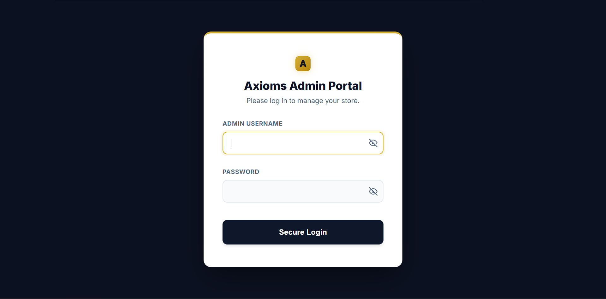
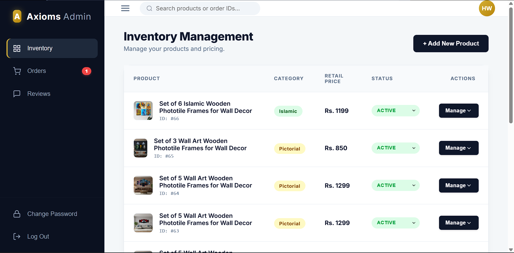
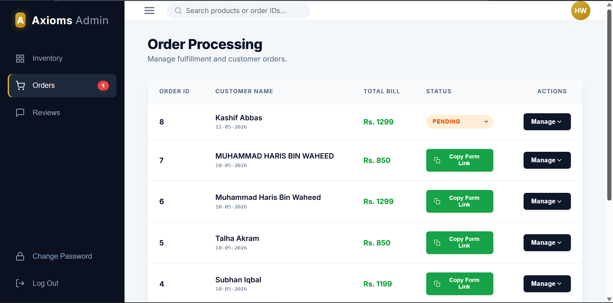
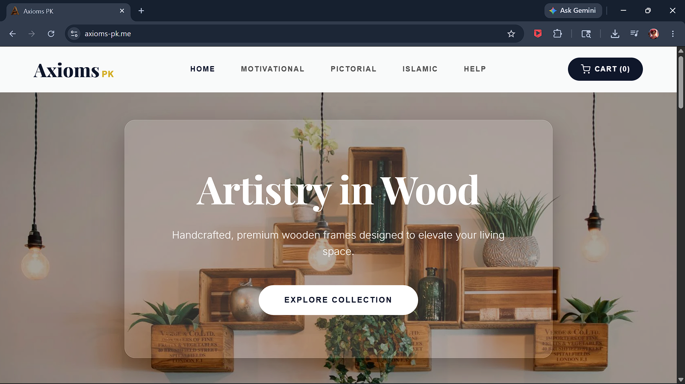
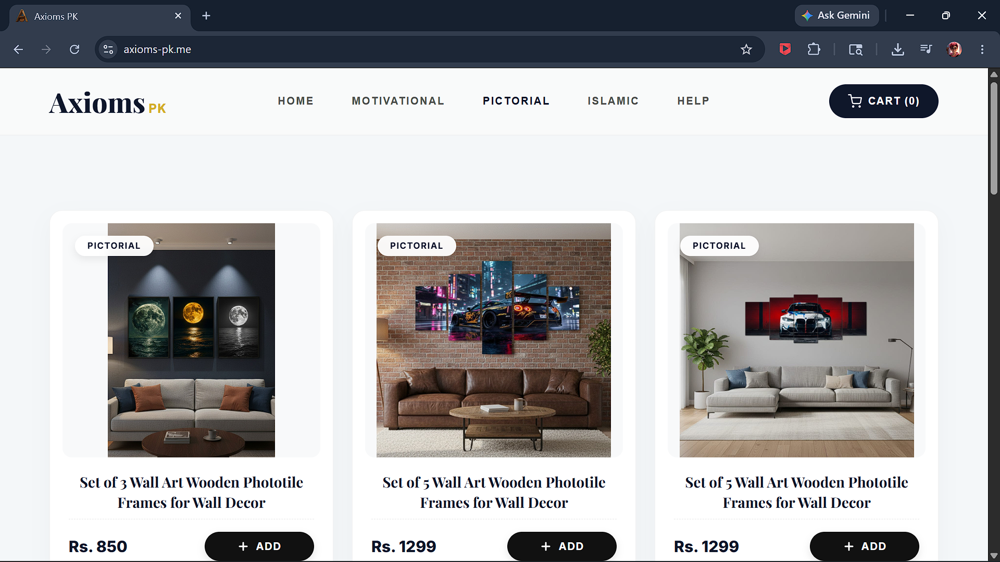
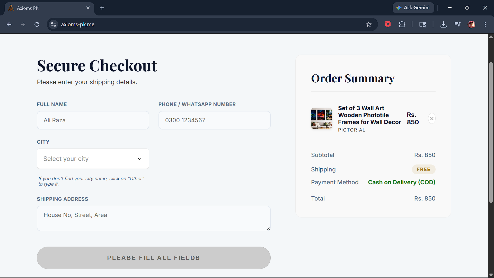
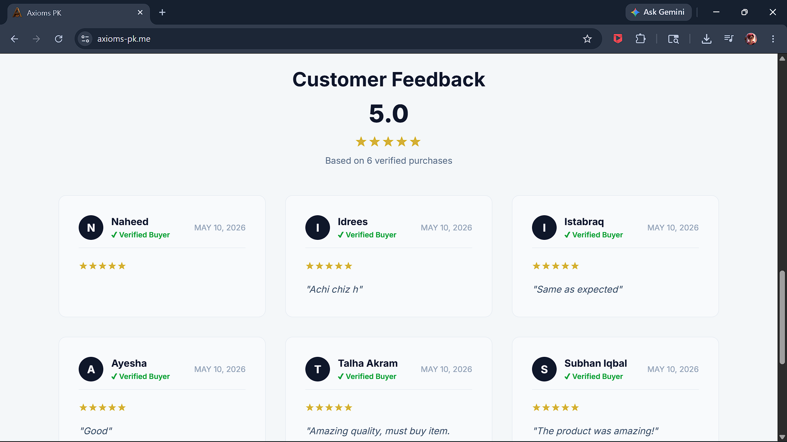

# Axioms Store - Backend Architecture

**Live Store:** [axioms-pk.me](https://www.axioms-pk.me/)

> **Note:** The actual backend and frontend source code is private to protect business IP, as this is a live commercial store. This repository outlines the system architecture and database design. I am happy to walk through the actual code or provide sanitized snippets during an interview.

---

## 📌 Architectural Overview

This system is a high-throughput REST API built with **FastAPI** (Python) and backed by an **Oracle 21c** relational database. It is engineered to handle inventory tracking, secure administrative authentication, and complex order processing for a custom e-commerce storefront.

### Core Technologies
* **API Framework:** FastAPI (Python 3.9+)
* **Database:** Oracle Database 21c Express Edition (integrated via `oracledb` driver)
* **Authentication:** Stateless JSON Web Tokens (JWT) using `python-jose` and `passlib[bcrypt]`
* **Data Validation:** Pydantic models for strict payload typing

---

## ⚙️ Backend Engineering Highlights

### 1. Database Layer (Oracle 21c)
The foundation of the platform relies on robust Oracle database architecture.
* **Transaction Management:** Utilizes explicit cursor management to handle complex multi-table inserts (e.g., mapping a single order payload into `orders` and multiple `order_items` tables).
* **Data Integrity:** Heavy database logic is offloaded to Oracle stored procedures where optimal, ensuring fast execution.

### 2. Stealth Admin Security & JWT Authentication
To mitigate automated brute-force attacks, administrative endpoints are highly secured.
* **Stateless Sessions:** Administrators authenticate via a `/login` endpoint to receive a JWT.
* **Endpoint Protection:** FastAPI's dependency injection (`Depends(get_token)`) acts as a middleware guard, verifying token signatures before any database queries execute.

### 3. Server-Side Pagination
To prevent memory exhaustion and optimize API response times, large datasets (like order histories and review logs) implement server-side pagination using `limit` and `offset` parameters, ensuring the API remains lightning-fast regardless of database size.

---

## 📸 System Previews: The Admin Portal (Backend Operations)

The following screenshots demonstrate the secure administrative dashboard, which serves as a direct GUI for managing the Oracle database and interacting with protected API routes.

### Stealth Admin Authentication
Protected via JWT and hidden application routing.

### Inventory API Management
Executing CRUD operations to push product updates directly to the Oracle database.

### Order Processing Engine
Fetching paginated transaction data for fulfillment and managing delivery states.

### Review Moderation API
Administrators retain full control over customer feedback visibility via the moderation endpoint.

---

## 📸 System Previews: The Storefront (API Consumption)

These assets demonstrate the frontend application successfully consuming the FastAPI endpoints and rendering the JSON payloads for the end user.

### Storefront Display
The live result of the backend delivering lightning-fast product arrays to the client.

### Category Filtering
Demonstrating instant dataset sorting based on active catalog items.

### Dynamic Item Fetching
Rendering specific product details queried via database IDs.

### The Checkout Engine
The frontend consolidates the cart and submits a strictly validated JSON payload to the FastAPI backend.

*(Video Demonstration of the Checkout Flow)*

### Tokenized Customer Feedback
Customers use unique, backend-generated URL tokens to securely submit reviews post-delivery.

---

## 📬 Contact & Technical Review

I am actively seeking Software Engineering roles specializing in Backend Development and Database Architecture. If you are a recruiter or hiring manager and would like a technical walkthrough of the FastAPI routing, React integration, or Oracle database schemas, please reach out to schedule an interview.
